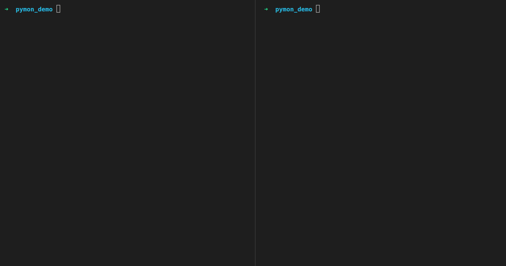

# pymon

pymon is a CLI tool that helps develop Python applications by re-running the application whenever file changes are detected in the directory.
It is written in the Rust programming language and will be installable on Windows, macOS and Linux when production ready.



## Installation
Download the wheel file for your operating system from the [releases page](https://github.com/aidantomcy/pymon/releases)  
Open your terminal to the folder where you've downloaded the wheel file, and then run:
```
pip install pymon-*.whl
```

## Usage

You can run and watch any Python file by simply running `pymon <your_app.py>`. If you do not specify a file name, it will print a help message.

## Credits

This project has been heavily inspired by [nodemon](https://github.com/remy/nodemon)
